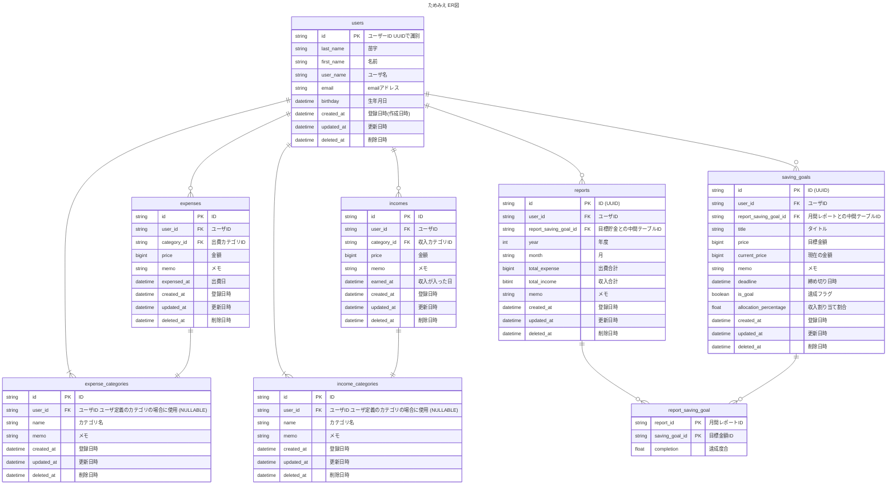

```mermaid
---
title: ためみえ ER図
---
erDiagram
    users {
        string id PK "ユーザーID UUIDで識別"
        string last_name "苗字"
        string first_name "名前"
        string user_name "ユーザ名"
        string email "emailアドレス"
        datetime birthday "生年月日"
        datetime created_at "登録日時(作成日時)"
        datetime updated_at "更新日時"
        datetime deleted_at "削除日時"
    }

    expenses {
        string id PK "ID"
        string user_id FK "ユーザID"
        string category_id FK "出費カテゴリID"
        bigint price "金額"
        string memo "メモ"
        datetime expensed_at "出費日"
        datetime created_at "登録日時"
        datetime updated_at "更新日時"
        datetime deleted_at "削除日時"
    }

    expense_categories {
        string id PK "ID"
        string user_id FK "ユーザID ユーザ定義のカテゴリの場合に使用 (NULLABLE)"
        string name "カテゴリ名"
        string memo "メモ"
        datetime created_at "登録日時"
        datetime updated_at "更新日時"
        datetime deleted_at "削除日時"
    }

    incomes {
        string id PK "ID"
        string user_id FK "ユーザID"
        string category_id FK "収入カテゴリID"
        bigint price "金額"
        string memo "メモ"
        datetime earned_at "収入が入った日"
        datetime created_at "登録日時"
        datetime updated_at "更新日時"
        datetime deleted_at "削除日時"
    }

    income_categories {
        string id PK "ID"
        string user_id FK "ユーザID ユーザ定義のカテゴリの場合に使用 (NULLABLE)"
        string name "カテゴリ名"
        string memo "メモ"
        datetime created_at "登録日時"
        datetime updated_at "更新日時"
        datetime deleted_at "削除日時"
    }

    reports {
        string id PK "ID (UUID)"
        string user_id FK "ユーザID"
        string report_saving_goal_id FK "目標貯金との中間テーブルID"
        int year "年度"
        string month "月"
        bigint total_expense "出費合計"
        bitint total_income "収入合計"
        string memo "メモ"
        datetime created_at "登録日時"
        datetime updated_at "更新日時"
        datetime deleted_at "削除日時"
    }

    saving_goals {
        string id PK "ID (UUID)"
        string user_id FK "ユーザID"
        string report_saving_goal_id FK "月間レポートとの中間テーブルID"
        string title "タイトル"
        bigint price "目標金額"
        bigint current_price "現在の金額"
        string memo "メモ"
        datetime deadline "締め切り日時"
        boolean is_goal "達成フラグ"
        float allocation_percentage "収入割り当て割合"
        datetime created_at "登録日時"
        datetime updated_at "更新日時"
        datetime deleted_at "削除日時"
    }

    report_saving_goal {
        string report_id PK "月間レポートID"
        string saving_goal_id PK "目標金額ID"
        float completion "達成度合"
    }

    users ||--o{ expenses: ""
    users ||--|{ expense_categories: ""
    users ||--o{ incomes: ""
    users ||--|{ income_categories: ""
    users ||--o{ reports: ""
    users ||--o{ saving_goals: ""
    expenses ||--|| expense_categories: ""
    incomes ||--|| income_categories: ""
    reports ||--o{ report_saving_goal: ""
    saving_goals ||--o{ report_saving_goal: ""
```
